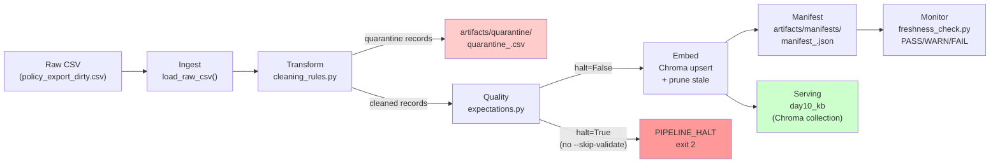

# Kiến trúc pipeline — Lab Day 10

**Nhóm:** Ning  
**Cập nhật:** 2026-04-15

---

## 1. Sơ đồ luồng

**Điểm đo freshness:** Sau bước Embed — `latest_exported_at` được đọc từ trường `exported_at` của cleaned CSV và ghi vào manifest. Freshness check đọc manifest và so sánh với `now()`.

**run_id:** Được truyền vào qua `--run-id` (hoặc sinh tự động từ UTC timestamp). Mỗi artifact đều mang tên `_<run_id>` để truy vết.

---

## 2. Ranh giới trách nhiệm

| Thành phần | Input | Output | Owner nhóm |
|------------|-------|--------|------------|
| Ingest | `data/raw/policy_export_dirty.csv` | `List[Dict]` raw rows, ghi `raw_records` vào log | data-platform-team |
| Transform | Raw rows + `apply_refund_window_fix` flag | `cleaned_rows`, `quarantine_rows` CSV (với `reason` field) | data-platform-team |
| Quality | `cleaned_rows` | `List[ExpectationResult]`, `halt: bool` — log từng expectation OK/FAIL | data-platform-team |
| Embed | `cleaned_rows`, Chroma DB path/collection | `embed_upsert count`, `embed_prune_removed` — upsert theo chunk_id, prune vector cũ | data-platform-team |
| Monitor | `manifest_<run_id>.json` | `freshness_check=PASS/WARN/FAIL` với `age_hours` và `sla_hours` | data-platform-team |

---

## 3. Idempotency & rerun

Pipeline sử dụng chiến lược **upsert theo `chunk_id`**:

- `chunk_id` được tính bằng SHA-256 prefix của `doc_id|chunk_text|seq` — tức là cố định với cùng một nội dung và vị trí.
- Khi chạy lại với cùng input CSV: Chroma `collection.upsert()` cập nhật metadata nhưng không tạo vector trùng.
- **Prune stale:** Sau mỗi upsert, pipeline lấy danh sách tất cả IDs trong collection, so sánh với IDs vừa upsert, và xoá các IDs không còn xuất hiện (`embed_prune_removed` trong log). Điều này đảm bảo collection luôn phản ánh snapshot mới nhất — không phải append-only.
- **Kết quả:** Chạy 2 lần liên tiếp với cùng CSV → `embed_prune_removed=0`, `embed_upsert count` không đổi, không có vector duplicate.

---

## 4. Liên hệ Day 09

- **Day 09** embed trực tiếp từ `data/docs/*.txt` (5 file policy) vào Chroma collection `day09_kb`.
- **Day 10** thêm một con đường ingest mới: từ CSV export (mô phỏng data warehouse hoặc API export), qua ETL pipeline, vào collection riêng `day10_kb`.
- Hai collection tách biệt để tránh ô nhiễm kết quả giữa hai lab. Nếu muốn Day 09 agent sử dụng corpus đã clean của Day 10, chỉ cần đổi `CHROMA_COLLECTION=day09_kb` trong `.env` và chạy lại pipeline.
- Điểm cải thiện so với Day 09: Day 10 thêm lớp kiểm soát chất lượng (expectation suite, quarantine, freshness monitoring) trước khi dữ liệu vào retrieval — giúp agent không nhận thông tin lỗi thời hay mâu thuẫn.

---

## 5. Rủi ro đã biết

- **Freshness FAIL trên sample data:** `exported_at=2026-04-10T08:00:00` trong CSV mẫu là cũ hơn 24 giờ so với thời điểm chạy lab (2026-04-15). Đây là hành vi đúng — cần cập nhật `exported_at` trong CSV thật hoặc nâng `FRESHNESS_SLA_HOURS` có lý do.
- **BOM/control chars im lặng:** Trước Rule A, một row có BOM trong `doc_id` sẽ bị quarantine với lý do `unknown_doc_id` mà không có thông báo rõ. Sau Rule A, BOM được strip và row được cứu.
- **Future-date rows:** Trước Rule B + E7, một row có `effective_date=2099-12-31` sẽ lọt vào vector store và agent có thể trích dẫn chính sách chưa có hiệu lực. Sau khi thêm rule, bị chặn ở tầng Transform và một lần nữa ở tầng Quality (E7 halt).
- **Eval dùng keyword matching:** `eval_retrieval.py` kiểm tra sự có mặt của chuỗi con (`must_contain_any`, `must_not_contain`), không phải semantic similarity. Một câu trả lời sai được diễn đạt khác sẽ không bị bắt.
- **Sample size nhỏ:** CSV mẫu chỉ 10 rows — ý nghĩa thống kê thấp cho các metric quarantine/cleaned.
